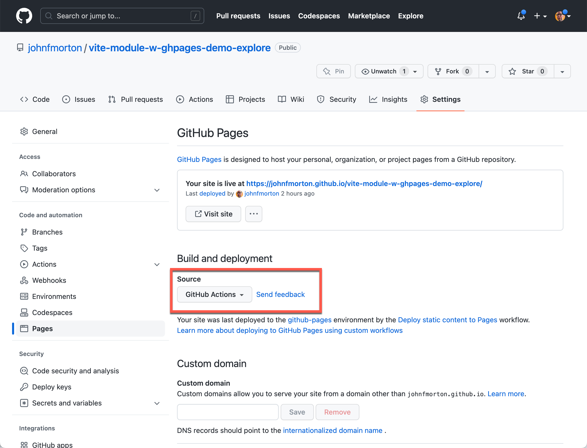

# Vite module builder template with automated GitHub Pages and npm publishing

This is a repo serves as a template workflow that uses Vite to help you create a module, exported as an ES module and/or a Common JS module and/or Universal Distribution.

It features a development page to easily test your module during development. The development page is preconfigured with Tailwind CSS. Note that Tailwind CSS is _not_ included in the published module. If you are developing a web componet, for example, and want to use Tailwind CSS, you will need to include it in your project.

Two preconfigured GitHub Actions are also included. The first will plubish a demo page to GitHub pages every time you upload your changes to the `main` branch. The second workflow allows you to publish your module to NPM every time you push a commit to GitHub with a new version number in your package.json file.

You write your module in Typescript and your published module will include an automatically generated type definition file.

## Installation

You can use it as a template to create your own repo. You can do this by clicking the "Use this template" button on the repo's home page.

This will create a new repo in your GitHub account. You can then clone the repo to your local machine and start working on your module.

## Video walk through

You can read about this repo on [my blog, SuperGeekery.com](https://supergeekery.com/blog/make-javascript-module-creation-easier-with-vite-and-automated-github-pages-and-npm-publishing). Below is a link to the video walk through that's part of the blog post.

[](https://youtu.be/fqL4Td5hYY0)

## Run the configuration script

This repo includes a configuration script that will help you update the name of your module and other settings. To run the script, you will need to have Node installed on your machine. You can download it from https://nodejs.org/en/download/.

Once you have Node installed, you can run the script by opening a terminal window and navigating to the root of the repo.

You will need to have two pieces of information to run the script:

1. The name of your module. This needs to be a valid name for a web componet. It can only contain lowercase letters, numbers, and dashes. It must start with a letter. It cannot contain spaces or any other characters.
2. The name of the GitHub repo URL. This is the URL of the repo you are working on. It should be in the format of `https://<USERNAME>.github.io/<REPO>/`.


Then run the following command:

```bash
npm run project-setup
```

This will replace all the instances of "vite-module-builder-w-ghpages-npm-template" with the name of your module. It will also update the `package.json` and `vite.demo.config.js` files with the git repository URL.

The script will also run `npm install` to install the dependencies for the repo. There is [additional information about the files](#additional-information-about-the-files) at the end of the document.

In your `package.json` file, the name of your module will be set to the name you provided. You can change this to whatever you want. The default is `vite-module-builder-w-ghpages-npm-template`. If you are publishing to an organization, you will need to set the name to `@<ORG_NAME>/<MODULE_NAME>`. For example, if your organization is called "my-org" and your module is called "my-module", you would set the name to `@my-org/my-module`.

You can also set the version number to whatever you want. The default is "1.0.0". During development, I set this to "1.0.0-beta.1" or something similar. You can change this to whatever you want. See the "Tagging releases" section below for more information about publishing `latest` and `beta` releases.

The version number is used to determine if the module has changed and needs to be published to NPM. If you change the version number in the `package.json` file, the workflow will publish the module to NPM.

## How to work on your module

### Development

Once your files are updated, you can run `npm run dev` to start the development server for the demo page and get to work on your module by editing the typescript file in the `/lib` directory.

The demo page is the `index.html` file at the root of the project. It imports your module from the `/lib` directory so you can test it as you work on it. The script for your demo page is in the `/demo-page-assets` directory, `demo.ts`.

The `public` directory is where static assets are stored for the demo site. Think images, fonts, etc. This is where the `vite.config.ts` file will look for static assets to include in the build process. You can reference them in your HTML file using the `/` prefix. For example, if you have an image in the `public` directory called `image.png`, you can reference it in your HTML file like this:

```html

```

## Next steps


### About formats

The module is built using Vite and can be published in three different formats. The format you choose will depend on how you want to use the module. Out of the box, it will generate all three formats.

| Format | Type | Import | Use |
|--------|------|--------|-----|
| es | ES module | import | For modern browsers |
| cjs | Common JS module | require | For Node.js |
| umd | Universal module | import or require | For both modern browsers and Node.js |

If you want to use the module in a modern browser, you can use the ES module format. This is the default format for modern browsers and is the most efficient way to load modules.

You may want to *only* publish the ES module format. You can do this by updating the `vite.config.ts` file to only include the ES module format. You will also need to update the `package.json` file to only include the ES module format.

## Publishing your module to NPM

The publishing process has evolved from version 1.0 to 2.0 for a more intentional release workflow. Previously, updating the version in package.json and pushing to GitHub automatically triggered an NPM release. Now, version 2.0 introduces a more deliberate process with tagging.

### A primer on tags in Git and NPM

This section is a brief overview of the tagging process in Git and NPM. Unfortnately, this may be a bit confusing at first.

Tag exists in both Git and NPM contexts, but they serve different purposes. Let's breakdown clarify the distinction and explain their roles.

### Git Tags

In Git, a tag is a reference to a specific commit in the repository's history. Tags are often used to mark important points in the project, such as releases or milestones. They are immutable and serve as a snapshot of the code at that point in time.

### NPM Tags

In NPM, a tag is a label that can be assigned to a specific version of a package. Tags are used to manage different versions of a package and control which version is installed when users run `npm install <package-name>`. The most common tag is "latest," which indicates the most recent stable version of the package.
When you publish a package to NPM, you can assign it a tag. By default, the latest version is tagged as "latest." However, you can also create custom tags (e.g., "beta," "alpha") to indicate pre-release versions or specific stages of development.

Take a look at the `package.json` file in the root of the repo. You will see a line that looks like this:

```json
"publishConfig": {
  "access": "public",
  "tag": "latest"
}
```

This line tells NPM to publish the package with the "latest" tag. You can change this to whatever you want. The default is "latest". You can also set it to "next" for pre-release or "beta" for beta release.

### The publishing process

## Step 1: Commit changes

Ensure that all changes are committed to your local repository. This includes any modifications to the code, documentation, or other files. You also need to ensure that the version number in your `package.json` file is updated to reflect the new version of your module.

For example, if you are releasing version 1.2.3 of your module, you would update the version number in the `package.json` file to "1.2.3".

```sh
{
  "name": "my-module",
  "version": "1.2.3",
  "publishConfig": {
     "access": "public",
     "tag": "latest"
   }
  ...
}
```

But, if this is an early development version, you might want to set it to "1.2.3-beta.1" or something similar.

```sh
{
  "name": "my-module",
  "version": "1.2.3-beta.1",
  "publishConfig": {
     "access": "public",
     "tag": "beta"
   }
  ...
}
```

To commit this to GitHub, you would run the following commands:

```sh
git add .
git commit -m "Prepare release v1.2.3"
git push origin main
```

At this point, you have committed your changes to the local repository and pushed them to GitHub. You can also use a GUI like Git Tower to do this.

## Step 2: Create a git tag and push it to Github

Next, you need to create a tag for the release. To trigger the NPM publishing process, you need to create a tag that begins with "v" followed by the version number. For example, if you are releasing version 1.2.3 of your module, you would create a tag called "v1.2.3". The reason for this is that the trigger in the `build.yml` file is looking for a tag that begins with "v" followed by the version number. This is a common convention in the Git community and is used by many projects.

You can create a tag by running the following command:

```sh
git tag v1.2.3
```

This will create a tag called "v1.2.3" in your local repository.

Next, you need to push the tag to GitHub. You can do this by running the following command:

```sh
git push origin v1.2.3
```

This will push the tag to GitHub and trigger the NPM publishing process.

### Testing your npm package

To test your npm package before publishing it, you can use the `npm pack --dry-run` command. No actual tarball will be created, but you will see the contents of the package that would be created if you were to publish it. You can expect output similar to the following:

```sh
npm pack --dry-run

npm notice
npm notice 📦  @my-org/my-module@1.2.3
npm notice Tarball Contents
npm notice 9.2kB README.md
npm notice 170B dist/my-module.d.ts
npm notice 193B dist/my-module.d.ts.map
npm notice 703B dist/my-module.es.js
npm notice 1.1kB dist/my-module.umd.js
npm notice 2.0kB package.json
npm notice Tarball Details
npm notice name: @my-org/my-module
npm notice version: 1.2.3
npm notice filename: my-org-my-module-1.2.3.tgz
npm notice package size: 4.7 kB
npm notice unpacked size: 13.3 kB
npm notice shasum: 8090b323f3959194fe7b3e6e0b7cc2f9941cbfae
npm notice integrity: sha512-PrSdR4qWeScTZ[...]ZyMYU/GG8w0eA==
npm notice total files: 6
npm notice
my-org-my-module-1.2.3.tgz
```

To view the actual file that will be created, simply leave off the `--dry-run` flag.

```sh
npm pack
```

This will create a .tgz file in the current directory. You can then extract this file to see the contents of the package.

### Organizational repos

Organizational packages default to private. If you want them public, you need to add an additional `--access public` flag to the publish command. This build system assumes your published package will be public. Note this setting in the `package.json` file:

```json
"publishConfig": {
  "access": "public"
}
```

### Publishing your module to NPM for the first time

If you publish your module to NPM for the first time from the local command line, you will need to run the following command:

```sh
npm publish --access public
```

Tagging the release as `latest` will allow you to publish a new version of your module to NPM. You can do this by running the following command:

```sh
git tag v1.2.3
git push origin v1.2.3
```

### GitHub Pages

The `.github/workflows/ghpages.yml` file is the workflow that will get your demo page published as the repo's demo page. You *must* set this up in your repo for it to work. You can do this by going to the repo's settings, then to the "Pages" section. Click the "Source" dropdown and select "GitHub Actions" as shown below.



### NPM publishing

In your GitHub repo, you will need a key from your NPM repository that will allow you to publish. This will be stored in your GitHub secrets for the repo. In the `.github/workflows/build.yml` file, you will need a reference to it, `secrets.NPM_TOKEN`. If you choose a different name for your secret, you will need to update the workflow file.


In the repo's settings, you will need to add the secret to the repo. You can do this by going to the repo's settings, then to the "Secrets and variables" section and then select the "Actions" section. Click the "New repository secret" button and add the secret as shown below.

#### Github Secrets


This script only attempts to run when you change the version number in the `package.json` file. During early development, I don't set this up immediately. This means the intial push to GitHub will cause this script to fail. You can ignore this failure. Once you have set up NPM publishing, you can then update the version number in the `package.json` file and push the commit to GitHub. This will cause the script to run and publish your module to NPM.

The variable name `NPM_TOKEN` is the name of the secret you created in the previous step. You can change this to whatever you want, but you will need to update the workflow file to match.

### How to disable the GitHub Pages and NPM publishing

If you don't want to publish your demo page to GitHub Pages or your module to NPM, you can disable the workflows. I do this early in development to keep these processes running before I'm at that stage of development. You can do this by going to the repo's settings, then to the "Actions" section. Click the "Disable Actions" button as shown below.


You can re-enable the workflows by clicking the "Enable Actions" button on this same screen when you are ready.


## Additional information about the files

The configuration script should have updated all the files in the repo with the name of your module, but it is important to understand what is in the repo and how it works, keep reading.

The most important file in this repo is the `lib/vite-module-builder-w-ghpages-npm-template.ts` file.

The name of the file is important. It is the name of the module you are creating. You will need to update the name of the file and the name of the module in the file.

* index.html - The demo page for your module. Use it to test your module. It will also serve as the demo page for your module when you publish it to GitHub Pages.
* package.json - The package.json file for your module. You will need to update the name of the module in the file.
* README.md - The README.md file for your module. You will need to update the name of the module in the file plus create documentation for your module.
* vite.config.ts - The Vite configuration file for your module build process.
* vite.demo.config.js - The Vite configuration file for your demo page build process for GitHub Pages.
* lib/vite-module-builder-w-ghpages-npm-template.ts - The demo page imports this file to test your module. You will need to update the name of the module in the file.

For a working example, check out this repo: https://github.com/johnfmorton/progressive-share-button

You will see how I use "progressive-share-button" as the name of the module and the name of the file. I also use it in the `package.json` file.

`lib/vite-module-builder-w-ghpages-npm-template.ts` is where you create the module you are working on. For this demo, it is a simple function that looks for an HTML element with the id of "messageOutput" and then sets the text of that element to the message you pass in. The file serves as a starting point for you to build your module. Ultimately, you will use Vite to create a Command JS module and a ESM module. See the `package.json` file for references to both of these.

The other imporatnt page is the `index.html` file. This is the demo page for your module. It includes the `demo-page-assets/demo.ts` file which is where you will write the code to test your module. This page is using Vite for development and the build process.

You can see the demo page for this repo at:

https://johnfmorton.github.io/vite-module-builder-w-ghpages-npm-template/

## License

This repo is licensed under the MIT license. You can use it for any purpose you want. You can also modify it and use it in your own projects. If you do, I would appreciate a link back to this repo so others can find it.
