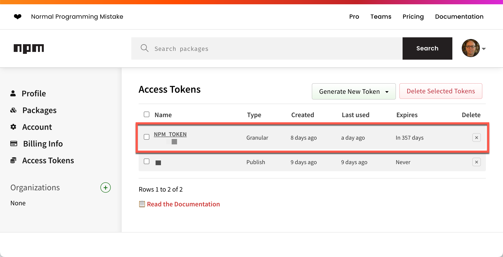
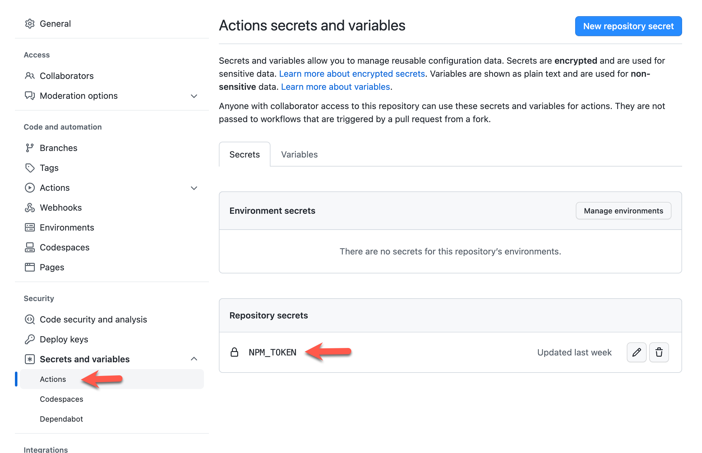
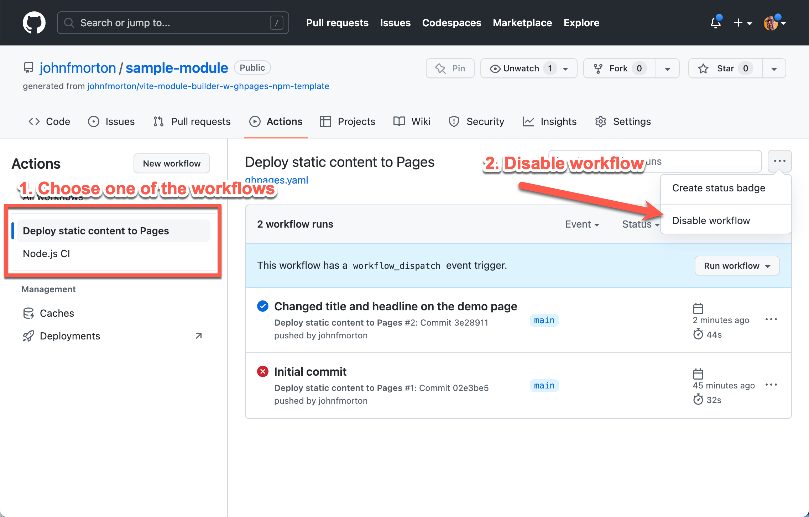

# Vite Module Builder Template

[](https://github.com/johnfmorton/vite-module-builder-w-ghpages-npm-template/actions/workflows/build.yml)
[](https://github.com/johnfmorton/vite-module-builder-w-ghpages-npm-template/actions/workflows/ghpages.yaml)
[](LICENSE)

A modern Vite-based module builder template with automated publishing to both
**GitHub Pages** (for demos) and **NPM** (for distribution).

- 📦 Output: ES, CommonJS, and UMD formats
- 🧪 Demo page with Tailwind CSS
- 🔁 Automated workflows: NPM release + GitHub Pages deploy
- ✍️ Built-in project setup script
- 🧠 Written in TypeScript

---

## 📚 Table of Contents

- [Vite Module Builder Template](#vite-module-builder-template)
  - [📚 Table of Contents](#-table-of-contents)
  - [🧰 Overview](#-overview)
  - [🚀 Getting Started](#-getting-started)
    - [Use as a Template](#use-as-a-template)
    - [Setup Script](#setup-script)
  - [🛠 Development Workflow](#-development-workflow)
  - [🛠 Initial setup for GitHub and NPM](#-initial-setup-for-github-and-npm)
    - [Configuring NPM publishing locally](#configuring-npm-publishing-locally)
    - [Creating a Personal Access Token for NPM](#creating-a-personal-access-token-for-npm)
    - [GitHub Secrets](#github-secrets)
    - [How to disable the GitHub Pages and NPM publishing](#how-to-disable-the-github-pages-and-npm-publishing)
  - [📦 Build Formats](#-build-formats)
    - [Testing your npm package](#testing-your-npm-package)
  - [📤 Publishing to NPM](#-publishing-to-npm)
    - [A primer on tags in Git and NPM](#a-primer-on-tags-in-git-and-npm)
    - [Git Tags](#git-tags)
    - [NPM Tags](#npm-tags)
    - [Versioning](#versioning)
    - [Step-by-step](#step-by-step)
  - [⚙️ GitHub Actions](#️-github-actions)
    - [NPM Publish](#npm-publish)
    - [GitHub Pages Demo Deploy](#github-pages-demo-deploy)
    - [Disabling](#disabling)
  - [🧾 File Structure \& Purpose](#-file-structure--purpose)
  - [🌐 Live Demo \& Example](#-live-demo--example)
  - [📄 License](#-license)

---

## 🧰 Overview

This repo is a starter workflow for building and publishing JavaScript modules
with Vite. It:

- Supports **ESM**, **CommonJS**, and **UMD** outputs
- Includes a demo page with Tailwind CSS (not bundled in the module)
- Automates publishing with GitHub Actions
- Uses a simple setup script to personalize the template

Great for creating standalone libraries, custom elements, or utility modules.

---

## 🚀 Getting Started

### Use as a Template

Click "Use this template" on the GitHub repo homepage to create a new repo under
your GitHub account.

### Setup Script

Once cloned and downloaded to your development machine, run the setup script:

```bash
npm run project-setup
```

You'll be prompted for:

- The module name (e.g., `my-module-name`)
- The GitHub Pages base URL (e.g., `https://<USERNAME>.gitHub.io/<REPO>/`)

This updates filenames, `package.json`, and `vite.demo.config.js`. It also runs
`npm install`.

You will see a reminder to
[turn off your GitHub actions](#how-to-disable-the-github-pages-and-npm-publishing)
at this point. You can re-enable them when you are ready.

---

## 🛠 Development Workflow

Run the dev server:

```bash
npm run dev
```

The general workflow is that you'll have a basic HTML page that includes your module. You'll work on the module itself in the `lib` directory.

Here is a overview of the files and locations.

- Work on your module in `lib/your-module.ts` file.
- Your demo site's HTML and assets are in the `demo` directory.
- Demo script logic lives in `demo/assets/demo.ts`
- Note of how the library you're working on is included in the `demo.ts` file,
  `../../lib/`
- Your demo site will be available at `http://localhost:8888/` and will has hot module replacement so you can see your changes as you make them.

When you are happy with a basic initial version, commit your changes to your
local git repo:

```bash
git add .
git commit -m "Initial commit"
```

## 🛠 Initial setup for GitHub and NPM

Before we push to GitHub, we need to set up the repo for GitHub Pages and NPM
publishing.

### Configuring NPM publishing locally

I recommend publishing your initial version to NPM as an alpha version from your
local repo. This way, you can test the publishing process and make sure
everything works as expected. After you've published at least one, you can also
generate a token on the NPM website that is specific to your package. If the
package has not been published yet, you will not be able to generate a token
specific to the package.

**Let's go over this step-by-step.**

First, update your `package.json` file to include the following `publishConfig`
section:

```json
"publishConfig": {
    "access": "public",
    "tag": "alpha"
},
```

Also in the `package.json`, update the version number to something like
`1.0.0-alpha.0`. You should also confirm that you have the correct `name` that you intend to publish your module under. For example, I add `@morton-studio/` before the name of my module to have it published under my organization name.

Next, build a local version of your package using the following command:

```bash
npm run build
```

This will create a `dist` folder on your local machine with the built files. The
files in the `dist` folder are what will be published to NPM. The files in this
directory are excluded from the GitHub repo, so you will not add them to the
repo.

I will assume you have already
[set up your NPM account](https://docs.npmjs.com/creating-a-new-npm-user-account).
Next, log in to NPM from the command line. If you have not done this before, run
the following command:

```bash
npm login
```

Once you are logged in, you can publish your package to NPM using the following
command:

```bash
npm publish
```

This will publish your package to NPM with the `alpha` tag.

Visit the homepage of your module on NPM to confirm that you see it published.

### Creating a Personal Access Token for NPM

In your GitHub repo, you will need a **Access Token** from your NPM repository that will
allow you to publish new versions of your module on your behalf. This will be stored in your GitHub secrets for the repo.
In the `.gitHub/workflows/build.yml` file, you will need a reference to it,
`secrets.NPM_TOKEN`. If you choose a different name for your secret, you will
need to update the workflow file.

For added security, I suggest creating a **Granular Access Token** for publishing to only this package. The token will need **Read and write** access.



### GitHub Secrets

In the repo's settings, you will need to add the secret to the repo. You can do
this by going to the repo's settings, then to the "Secrets and variables"
section and then select the "Actions" section. Click the "New repository secret"
button and add the secret as shown below. Use the name `NPM_TOKEN` unless you've changed it in your workflow file.



### How to disable the GitHub Pages and NPM publishing

If you don't want to publish your demo page to GitHub Pages or your module to
NPM, you can disable the workflows.

I do this early in development to prevent these processes from running before
I'm ready. You can do this by going to the repo's settings, then to the
"Actions" section. Click the "Disable Actions" button as shown below.



You can re-enable the workflows by clicking the "Enable Actions" button on this
same screen when you are ready.

Now that the initial setup is complete, let's run through the build process and
publishing to NPM.

---

## 📦 Build Formats

The build generates the following outputs by default:

| Format | Type     | Syntax    | Target                    |
| ------ | -------- | --------- | ------------------------- |
| `es`   | ESM      | `import`  | Modern browsers, bundlers |
| `cjs`  | CommonJS | `require` | Node.js                   |
| `umd`  | UMD      | Global    | Script tag/CDNs           |

You can control output formats via `vite.config.js`. Only want ESM?

```js
formats: ['es']
```

If you change the output formats, you will need to update the `package.json`
file to include the new formats. The `main` and `module` fields in the
`package.json` file should point to the correct files for each format.

### Testing your npm package

You can test the package without publishing:

```bash
npm run build
npm pack --dry-run
```

---

## 📤 Publishing to NPM

The publishing process has evolved from version 1.0 to 2.0 for a more
intentional release workflow. Previously, updating the version in package.json
and pushing to GitHub automatically triggered an NPM release. Now, version 2.0
introduces a more deliberate process with tagging.

### A primer on tags in Git and NPM

This section is a brief overview of the tagging process in Git and NPM.

Tag exists in both Git and NPM contexts, but they serve different purposes.
Let's breakdown clarify the distinction and explain their roles.

### Git Tags

In Git, a tag is a reference to a specific commit in the repository's history.
Git tags are often used to mark important points in the project, such as
releases or milestones. They are immutable and serve as a snapshot of the code
at that point in time.

### NPM Tags

In NPM, a tag is a label that can be assigned to a specific version of a
package. Tags are used to manage different versions of a package and control
which version is installed when users run `npm install <package-name>`. The most
common tag is "latest," which indicates the most recent stable version of the
package. When you publish a package to NPM, you can assign it a tag. By default,
the latest version is tagged as "latest." However, you can also create custom
tags (e.g., "beta," "alpha") to indicate pre-release versions or specific stages
of development.

### Versioning

Versioning is a crucial part of the release process. It helps you keep track of
changes and ensures that users can easily identify which version they are using.
Let's look at a few examples of versioning your module.

Update the `package.json` file for a normal (i.e. "latest") release:

```json
"version": "1.2.3",
"publishConfig": {
  "access": "public",
  "tag": "latest"
}
```

For prereleases:

```json
"version": "1.2.3-beta.1",
"publishConfig": {
  "tag": "beta"
}
```

### Step-by-step

After you've updated the code in your module and have updated your
`package.json` file, you are ready to publish your module to NPM.

**If you have disabled your GitHub Actions, turn them back on now.**

Note that we precede the version number with a `v` in the tag name. This is a
convention that is used by GitHub to identify tags. The version number should be
the same as the version number in your `package.json` file. The `v` also
triggers the GitHub Action to publish the module to NPM.

The process is as follows:

1. **Commit changes and push them to GitHub:**

   ```bash
   git add .
   git commit -m "Prepare release v1.2.3"
   git push origin main
   ```

2. **Tag the release and push the tag to GitHub:**

   ```bash
   git tag v1.2.3
   git push origin v1.2.3
   ```

Pushing the tag to GitHub triggers the GitHub Action to publish to NPM.

---

## ⚙️ GitHub Actions

### NPM Publish

- Triggered by a Git tag starting with `v`
- Requires `NPM_TOKEN` secret in GitHub repo

### GitHub Pages Demo Deploy

- Triggered on `main` branch updates
- ⚠️ Must configure GitHub Pages to use **GitHub Actions**

### Disabling

In early dev, you can disable actions from repo settings → Actions.

---

## 🧾 File Structure & Purpose

| File                            | Purpose                       |
| ------------------------------- | ----------------------------- |
| `lib/your-module.ts`            | Main module source file       |
| `index.html`                    | Demo/testing UI               |
| `demo-page-assets/demo.ts`      | Script for demo logic         |
| `public/`                       | Static assets                 |
| `vite.config.js`                | Build config (for publishing) |
| `vite.demo.config.js`           | Dev/demo config               |
| `.gitHub/workflows/ghpages.yml` | Deploys demo to GitHub Pages  |
| `.gitHub/workflows/build.yml`   | Publishes package to NPM      |

---

## 🌐 Live Demo & Example

**Live demo page:**
[https://johnfmorton.github.io/vite-module-builder-w-ghpages-npm-template/](https://johnfmorton.github.io/vite-module-builder-w-ghpages-npm-template/)

**Real-world example:**
[https://github.com/johnfmorton/progressive-share-button](https://github.com/johnfmorton/progressive-share-button)

---

## 📄 License

[MIT License](LICENSE)

Feedback and contributions are welcome! If you find this template useful,
consider giving it a star on GitHub. Happy coding!
